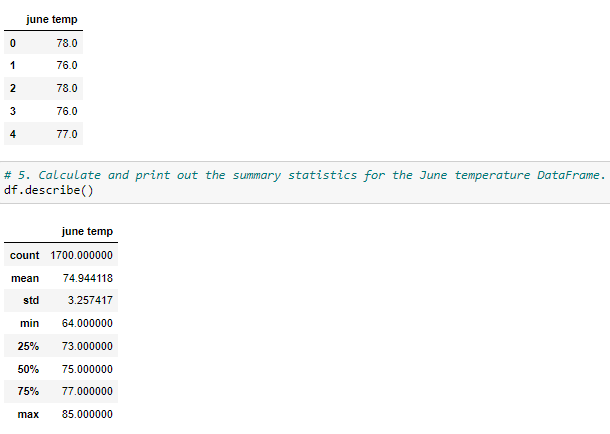
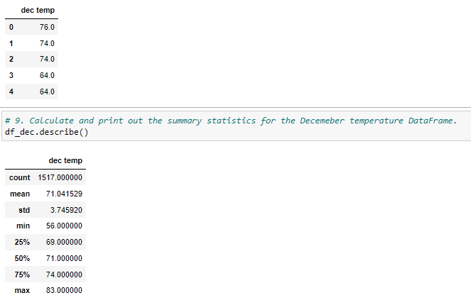

# Surfs_Up 

## Challenge Overview
### Overview of the Surfs_Up Analysis
 The purpose of this analysis was to gather temperature data for the months of June and December to determine whether the surf and ice cream business will do well year-round.

 ## Results

- Based on the count metric, June has roughly 200 more than Dec
- The average temp in June is 74.9 vs 71.0 in Dec
- June saw a min temp of 64 degrees and a high of 85 degrees, while Dec saw a min of 56 degrees and a high of 83 degrees

 

 

## Summary

Based on the above analysis, the temperature differences do not seem to vary greatly year round.